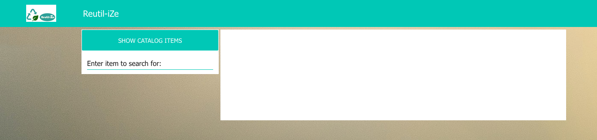

# Restful interactions with z/OS from containers

In this workshop, you will work with Node-RED. You will have the option to run Node-RED in IBM Cloud as a service or through Docker on IBM Cloud. We have created a website through the Node-RED dashboard nodes to interact with z/OS.

Once you've imported your flow into Node-RED you'll be working with a website like the one shown below. 

We are providing you with step-by-step directions to create this website for your. Just follow the actions below.

## Create a Node-RED service on IBM Cloud
There are two ways that you can create a Node-RED service on IBM Cloud. Running Node-RED in Docker on IBM Cloud starts up a bit faster initially. Other then that, they're exactly the same. You can choose whichever way you'd like and both are documented below. The Node-RED in Docker will be shown during the session.

### Option 1: Node-RED in Docker on IBM Cloud
Before we can use Docker to push a Node-RED container to IBM Cloud, we need to setup the pre-requisites.

**Pre-requisites**

* Create an IBM Cloud account: [https://www.ibm.com/uk-en/cloud/free](https://www.ibm.com/uk-en/cloud/free)
* Run Docker on your local workstation: [https://www.docker.com/products/docker-desktop](https://www.docker.com/products/docker-desktop)
* Create a Docker Hub account: [https://hub.docker.com/signup](https://hub.docker.com/signup)
* Setup IBM Cloud CLI on your local worksation: [https://cloud.ibm.com/docs/cli](https://cloud.ibm.com/docs/cli)

**Run Node-RED container in IBM Cloud**

1. `ibmcloud cf push Code-Think-NodeRED --docker-image nodered/node-red:1.1.3-10-amd64 --docker-username <docker-user>  -m 256M  --random-route`

```
~ ibmcloud cf push Code-Think-NodeRED --docker-image nodered/node-red:1.1.3-10-amd64 --docker-username jennfrancis  -m 256M  --random-route
Invoking 'cf push Code-Think-NodeRED --docker-image nodered/node-red:1.1.3-10-amd64 --docker-username jennfrancis -m 256M --random-route'...

Environment variable CF_DOCKER_PASSWORD not set.
Docker password:
Pushing app Code-Think-NodeRED to org jenn.francis@ibm.com / space dev as Jenn.Francis@ibm.com...
Getting app info...
Creating app with these attributes...
+ name:              Code-Think-NodeRED
+ docker image:      nodered/node-red:1.1.3-10-amd64
+ docker username:   jennfrancis
+ memory:            256M
  routes:
+   code-think-nodered-friendly-nyala.eu-gb.mybluemix.net

Creating app Code-Think-NodeRED...
Mapping routes...

Staging app and tracing logs...
   Cell 5f4df484-e14b-4e86-8fee-460dd0bd870d creating container for instance 2d51f058-cc9d-468f-bb69-5fb8790c465d
   Cell 5f4df484-e14b-4e86-8fee-460dd0bd870d successfully created container for instance 2d51f058-cc9d-468f-bb69-5fb8790c465d
   Staging...
   Staging process started ...
   Staging process finished
   Exit status 0
   Staging Complete
   Cell 5f4df484-e14b-4e86-8fee-460dd0bd870d stopping instance 2d51f058-cc9d-468f-bb69-5fb8790c465d
   Cell 5f4df484-e14b-4e86-8fee-460dd0bd870d destroying container for instance 2d51f058-cc9d-468f-bb69-5fb8790c465d
   Cell 5f4df484-e14b-4e86-8fee-460dd0bd870d successfully destroyed container for instance 2d51f058-cc9d-468f-bb69-5fb8790c465d

Waiting for app to start...

name:              Code-Think-NodeRED
requested state:   started
routes:            code-think-nodered-friendly-nyala.eu-gb.mybluemix.net
last uploaded:     Tue 06 Oct 17:16:24 BST 2020
stack:
docker image:      nodered/node-red:1.1.3-10-amd64

type:            web
instances:       1/1
memory usage:    256M
start command:   npm start --cache /data/.npm -- --userDir /data
     state     since                  cpu    memory          disk           details
#0   running   2020-10-06T16:16:52Z   0.0%   77.4M of 256M   433.1M of 1G
```

2. You can open your IBM Cloud Dashboard to see the service running as well.

* In a browser, open IBM Cloud and **select the dashboard icon** and **click on Cloud Foundry apps**.

* Click on your service from the list like the image shown below. 

3. To access Node-RED, select **Visit App URL** from the service details page. 

You are now setup and ready for the next section!


### Option 2: Node-RED starter app on IBM Cloud

**Pre-requisites**

* Create an IBM Cloud account: [https://www.ibm.com/uk-en/cloud/free](https://www.ibm.com/uk-en/cloud/free)

1. From the IBM Cloud page, select in the upper menu options **Catalog**.

2. In the search field type in **"Node Red"** and select the **Node-RED App**.

3. Click the **Get started** button to begin creating your Node-RED App.

4. Change the *App Name** to something unique like `NodeREDCodeAtThinkXXX` where XXX are your initials.

5. **Important*** Make sure you select the **Lite** pricing plan. This is the free version.

6. Click the **Create** button to create the app. This may take up to 30 seconds.


7. Look for and click the blue button **Deploy your app**. 

8. To configure your Node-RED app, complete the following:
 	* For this app, you'll need to create an API key. To do this, select the blue button **New** next to the field **API key** is needed. A popup will appear. 
	* Now select **Create**.
	
9. Towards the top of the page, select the **Cloud Foundry** square. 

10. Select your **Region** attached to your account. This is probably London if you're in the UK. Use the pull down menu to select the proper region. If you don't know which one to use, select them until the red errors dissapear. A host name will be generated. You can modify the host name if you'd like.

11. Press **Next** and **Create** to finish setting up the Node-RED app. 


	**Note:** We have created an Node Red app as well as a place in the Cloud where we can run the app on. Now the app will be deployed automatically. This can take up to 5 minutes. You can monitor the progess in the status field. Wait until the status changes from **In progress** to **Success**.
	


12. Click on the name of your app under **Delivery Pipelines**.


13. You have created the Node-Red app and you have deployed it in the IBM Cloud. Now, to go to your app select **View console**. 

14. Now you see the dashboard of your Node-Red app. Now select **Visit app URL**.

15. Now you are in your Node-Red app. When opening this the first time you will get some options to set an User ID and Password. Follow the steps until you get the Node-Red landing page with the button **Go to your Node-RED flow editor**.


You are now setup and ready for the next section!

## Work in Node-RED
In this section, we will install the additional Node-RED nodes we need for our website and then import a flow that has been configured to communicate with z/OS.

### Install additional nodes

1. Open the hamburger menu on the upper right corner(1). This opens a menu like the one shown below. Choose the option **Manage palette** (2). 

	Note: Manage Palette opens a screen where you can find all the Nodes which are installed and an option to search and install additional Nodes.

2. Select the **Install** tab. In the search field, type `dashboard`. This gives you all the nodes and node collections available with the name dashboard. Select the one called **Node-Red-Dashboard**. Select **Install** to the right of it to install the nodes. 


	**Note:** Some additional Nodes are being installed. This may take up to one minute. Please note that in some occasions a red error will occur saying that the installation has failed. You need to try again until you get a large green message that the installation was successful. This is a bug which can happen sometimes depending on your location.

3. Close the menu and return to the main screen. Inspect the tool tray on the left side
of the screen and look for the nodes installed under **dashboard** . 

	**Note:** The Dashboard Nodes are being used to build a graphical screen which you can use to interact. This will be our website. I have created the example website for you which uses these nodes.

### Import existing code

The next step is to import the example website so you do not have to build it
yourself from scratch. . . here we go!


1. Open the file [website.txt](website.txt). The file is provided in the Github repository
You can open it with any text editor installed on your computer. When opening it, it will look most probably weird and not understandable. don’t worry. This is why we use Node-Red, so we don’t need to understand the coding language.


3.2 Please open the file an select all the text(pressing ctrl +a) and then copy (ctrl + c).

3.3 Go back to your Node-Red environment and select the hamburger menu on the upper right corner. This opens the menu we already used.
Select “ **Import** ”.
This opens a screen where you can “paste” the code from the website.txt. 
Paste the code with ctrl + v. Now you will see the code appearing in the pink colored middle section.


3.4 Press “ **Import** ”.

3.5 Press the **“deploy”** button to save and activate the flow.

The Nodes are used to build the website which I have showed at the beginning. The
white blocks are text fields to explain what the nodes below do. Take a moment to
see how it is related to the website.


Tip: In order to see the webpage you need the same internet address as used for
your Node-Red environment **BUT** instead of having the **"/ red"** at the end use **"/ui"**. UI means User Interface. The URL should look something like this:


Node-Red environment-   **http://node-red-xxxxxxxx.mybluemix.net/red/**

Node-Red website-       **http://node-red-xxxxxxxxx.mybluemix.net/ui/**


